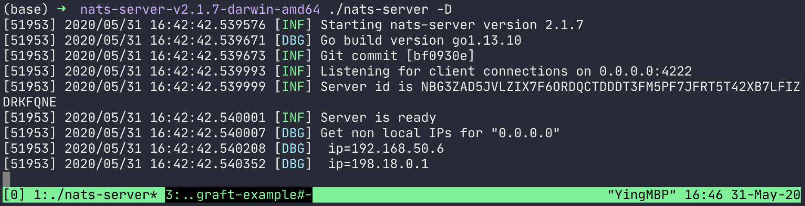
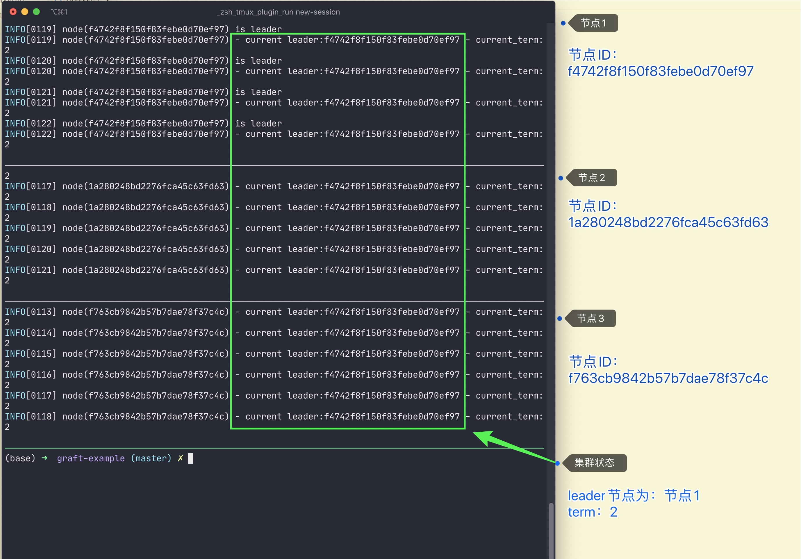
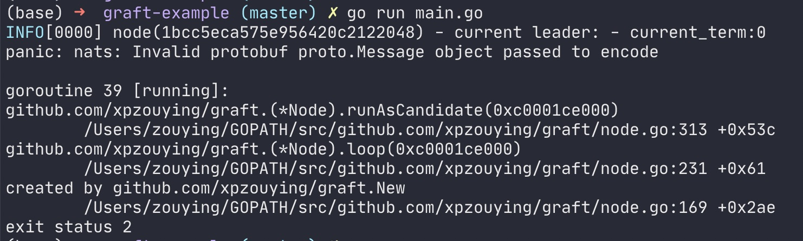

Graft
=====

Raft是一种通过复制日志实现的一致性算法。

一致性算法可以让由多个机器组成的集群像一台机器一样工作，即使其中部分成员出现错误，整个集群仍然可以正常工作。

关于Raft的理论可以参考，

- [raft论文（英文）](https://ramcloud.stanford.edu/wiki/download/attachments/11370504/raft.pdf
)
- [raft uiuc2016 pdf](https://raft.github.io/slides/uiuc2016.pdf)
- [raft.github.io](https://raft.github.io/)
- [raft论文 - 中文翻译](https://www.infoq.cn/article/raft-paper)
- [raft video（youtube）](http://www.youtube.com/watch?v=YbZ3zDzDnrw&list=WL20FE97C942825E1E)

[](https://www.apache.org/licenses/LICENSE-2.0)
[](http://travis-ci.org/nats-io/graft)
[](https://coveralls.io/github/nats-io/graft)


简介
=====

该项目是从[nats-io/graft](https://github.com/nats-io/graft)中fork而来，主要的目标是，

1. 中文化。
2. 完善文档。
3. 完善实例。我在运行实例时，发现无法运行起来。
4. 修复代码中的问题。


## graft

对于graft，由于是[nats.io](https://nats.io/)维护，所以该工程的实例rpc是基于nats消息系统实现，其中数据序列化是由protobuf处理。


## 运行

1. 运行nats server

   下载并运行nats server二进制。具体的下载地址：[nats server下载](https://nats.io/download/nats-io/nats-server/)

   ```bash
   # 以macos为例
   
   # 下载
   wget https://github.com/nats-io/nats-server/releases/download/v2.1.7/nats-server-v2.1.7-darwin-amd64.zip
   
   unzip ./nats-server-v2.1.7-darwin-amd64.zip
   
   cd nats-server-v2.1.7-darwin-amd64
   
   # -D: debug模式
   ./nats-server -D
   ```

   nats server启动后，会监听`0.0.0.0:4222`端口

   

2. 运行示例

   示例源码仓库：[graft-example](https://github.com/xpzouying/graft-example)

   ```go
   func main() {
   	ci := graft.ClusterInfo{Name: "zy_cluster", Size: 3}
   	opts := &nats.DefaultOptions
   	opts.Servers = []string{"localhost:4222"}
   	rpc, err := graft.NewNatsRpc(opts)
   	panicError(err)
   
   	errChan := make(chan error)
   	stateChangeChan := make(chan graft.StateChange)
   	handler := graft.NewChanHandler(stateChangeChan, errChan)
   
   	logfile := fmt.Sprintf("/tmp/graft-%d.log", rand.Int31n(100))
   	node, err := graft.New(ci, handler, rpc, logfile)
   	panicError(err)
   	defer node.Close()
   
   	for {
   		if node.State() == graft.LEADER {
   			// Process as a LEADER
   			logrus.Infof("node(%v) is leader", node.Id())
   		}
   
   		select {
   		case sc := <-stateChangeChan:
   			// Process a state change
   			logrus.Warnf("node(%v) state changed: %v", node.Id(), sc)
   		case err := <-errChan:
   			// Process an error, log etc.
   			logrus.Errorf("node(%v) got error: %v", node.Id(), err)
   		default:
   		}
   
   		logrus.Infof("node(%s) - current leader:%s - current_term:%v", node.Id(), node.Leader(), node.CurrentTerm())
   
   		time.Sleep(1 * time.Second)
   	}
   }
   ```

   示例说明：

   - 启动一个raft集群，命名为：zy_cluster，其中集群节点数量为3。
   - RPC通信是通过nats server。server的启动参考第1步。
   - raft的日志文件会保存在`/tmp/graft-%d.log`，其中%d为一个随机数。

3. 运行示例

   在第2步中，我们指定该集群有3个节点，所以可以启动3个进程。

   ```bash
   # 运行3次
   go run main.go
   ```

   截图如下，

   

## 其他事项

### 生成新的pb文件

原有仓库的pb文件中，会报错，需要使用golang/protobuf重新生成。



使用下列语句生成新的pb文件。

1. 安装protoc的Go语言插件

   ```bash
   go get github.com/golang/protobuf/protoc-gen-go
   ```

2. 进入pb文件夹，运行命令生成pb.go

   ```bash
   protoc --go_out=. *.proto
   ```

## License

Unless otherwise noted, the NATS source files are distributed
under the Apache Version 2.0 license found in the LICENSE file.
